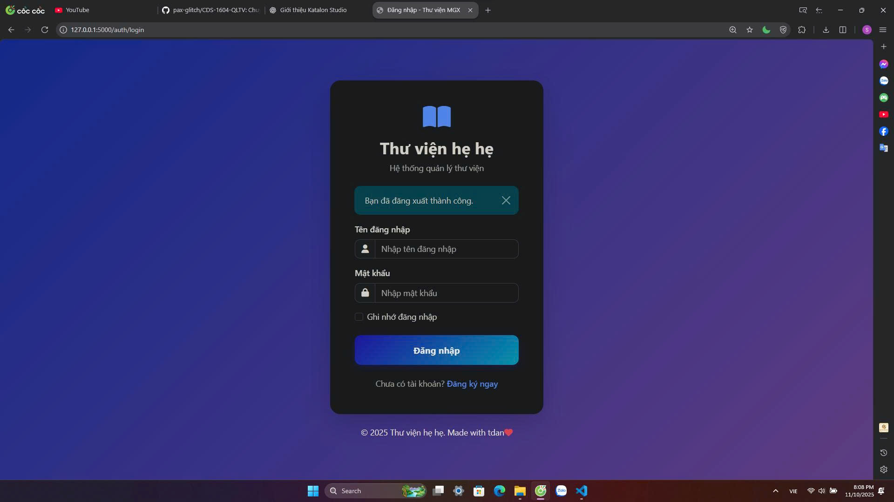
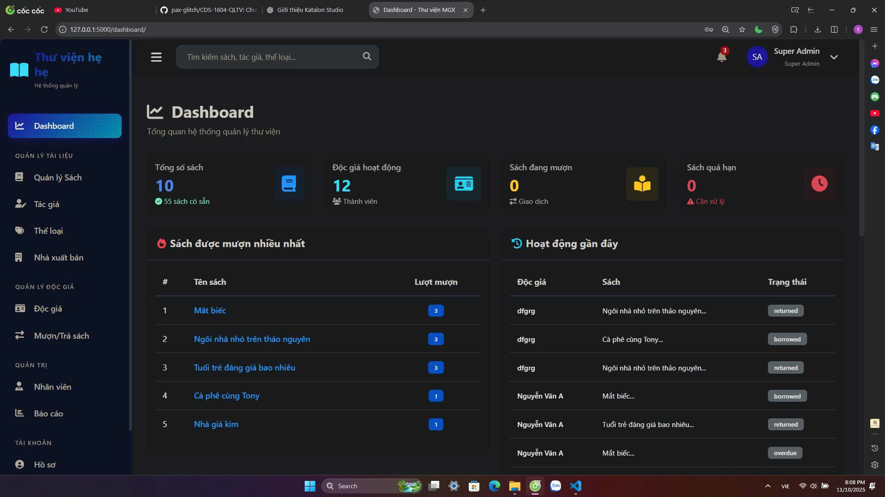
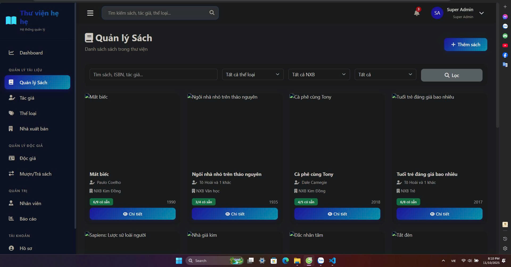
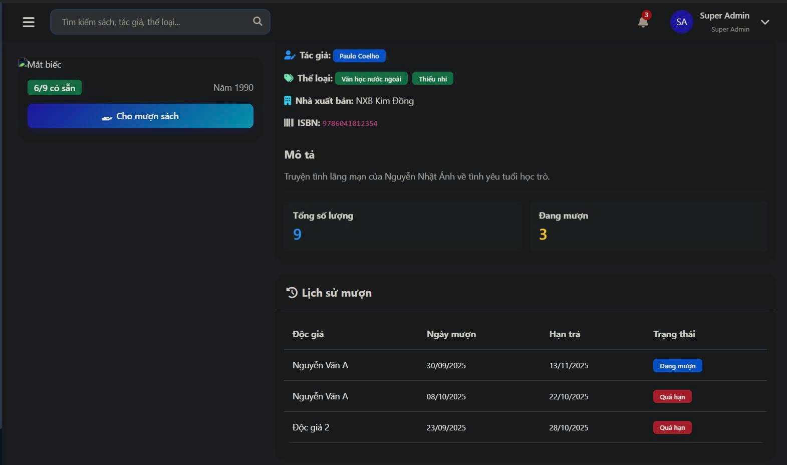
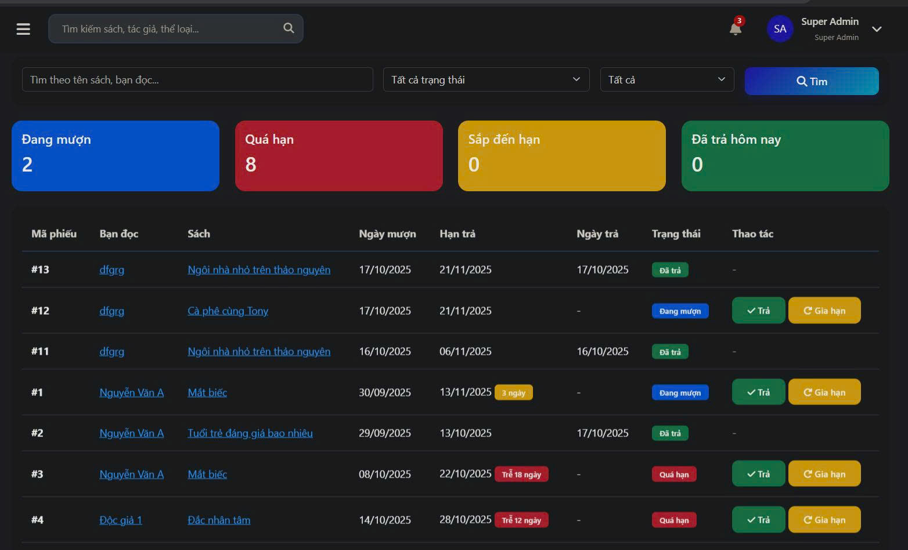
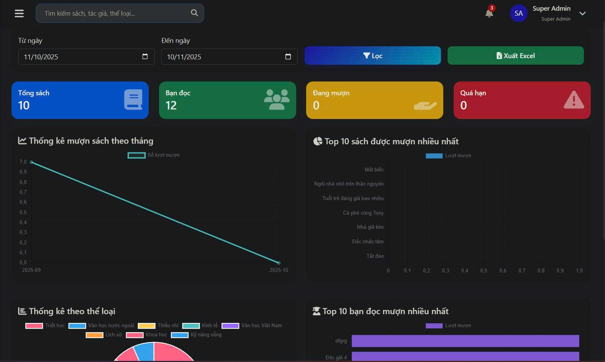
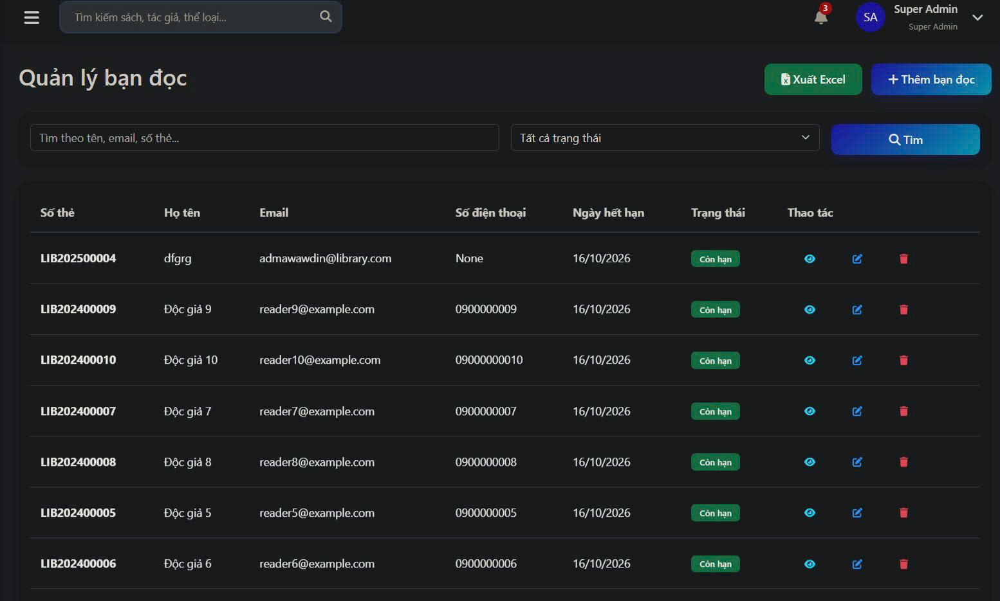

<h2 align="center">
    <a href="https://dainam.edu.vn/vi/khoa-cong-nghe-thong-tin">
    🎓 Faculty of Information Technology (DaiNam University)
    </a>
</h2>
<h2 align="center">
   HỆ THỐNG QUẢN LÍ THƯ VIỆN SỐ 
</h2>
<div align="center">
    <p align="center">
        
        
        
    </p>

[](https://www.facebook.com/DNUAIoTLab)
[](https://dainam.edu.vn/vi/khoa-cong-nghe-thong-tin)
[](https://dainam.edu.vn)

</div>

## 📖 **1. Giới thiệu hệ thống**  
Ứng dụng **Hệ thống Quản lý Thư viện Số MGX** là một giải pháp quản lý thư viện hiện đại được xây dựng bằng **Flask (Python)** với cơ sở dữ liệu **SQLite**, cung cấp đầy đủ các chức năng quản lý sách, độc giả, mượn/trả sách và báo cáo thống kê.

- **Web-based**: Truy cập qua trình duyệt, không cần cài đặt phần mềm
- **Multi-user**: Hỗ trợ nhiều người dùng đồng thời với phân quyền rõ ràng  
- **Real-time**: Cập nhật trạng thái mượn/trả sách tức thời
- **Responsive**: Giao diện thân thiện, tương thích mọi thiết bị

## ✨ **Tính năng chính**

### 🔐 **Xác thực & Phân quyền**
- **4 vai trò người dùng**: 
  - 👨‍💼 **Superadmin**: Toàn quyền quản trị hệ thống
  - 👨‍💼 **Admin**: Quản lý nội dung và người dùng
  - 👩‍💼 **Staff**: Xử lý mượn/trả sách, quản lý độc giả
  - 📚 **Reader**: Mượn sách, xem lịch sử cá nhân
- 🔒 Đăng nhập/Đăng ký với mã hóa **bcrypt**
- 🎯 Session-based authentication với **Flask-Login**
- 🛡️ CSRF Protection toàn diện
- 🔑 Phân quyền truy cập theo vai trò

### 📚 **Quản lý Tài liệu**
- **Sách**: CRUD đầy đủ với upload ảnh bìa, quản lý số lượng tồn kho
- **Tác giả**: Quản lý thông tin tiểu sử tác giả
- **Thể loại**: Phân loại sách theo 8 thể loại đa dạng
- **Nhà xuất bản**: Quản lý thông tin NXB, địa chỉ, liên hệ
- 🔗 Mối quan hệ many-to-many giữa sách-tác giả và sách-thể loại
- 🔍 Tìm kiếm và lọc nâng cao theo nhiều tiêu chí
- 📄 Phân trang server-side hiệu quả
- 📊 10 sách mẫu với ảnh bìa thật từ Tiki

### 👥 **Quản lý Độc giả**
- 💳 Thẻ thư viện với mã số duy nhất (LIB2024XXXXX)
- 📋 Quản lý thông tin cá nhân đầy đủ
- 📅 Theo dõi ngày cấp thẻ, ngày hết hạn
- 🚦 Trạng thái: **active**, **blocked**, **expired**
- 📖 Lịch sử mượn trả chi tiết của từng độc giả
- 📥 Export danh sách độc giả ra file Excel
- ✅ Kiểm tra tự động thẻ hết hạn

### 📖 **Mượn/Trả sách**
- ➕ Tạo phiếu mượn với kiểm tra số lượng sách tự động
- ✅ Xác nhận trả sách, cập nhật số lượng tức thời
- 🔄 Gia hạn sách (tối đa 3 lần, 7/14/21/30 ngày)
- ⏰ Tự động phát hiện và cập nhật sách quá hạn
- 🏷️ Trạng thái: **borrowed**, **returned**, **overdue**
- 📊 Quản lý số lượng sách có sẵn tự động
- ⚡ Real-time updates - không cần refresh

### 👨‍💼 **Quản lý Nhân viên**
- 👤 Quản lý tài khoản nhân viên (staff/admin)
- 🎭 Phân quyền vai trò linh hoạt
- 🔓 Kích hoạt/vô hiệu hóa tài khoản
- 📸 Upload avatar cá nhân
- 📊 Theo dõi hoạt động và thống kê

### 📊 **Dashboard & Báo cáo**
- 📈 **Thống kê tổng quan**: 
  - Tổng số sách, độc giả, phiếu mượn
  - Sách đang mượn, quá hạn, sắp đến hạn
- 📉 **4 Biểu đồ động** (Chart.js):
  - 📊 Thống kê mượn sách theo tháng (Line Chart)
  - 🏆 Top 10 sách được mượn nhiều nhất (Bar Chart)
  - 🎯 Thống kê theo thể loại (Doughnut Chart)
  - 👑 Top 10 độc giả mượn nhiều nhất (Bar Chart)
- 📋 Danh sách sách quá hạn cần xử lý
- 🕐 Hoạt động gần đây theo thời gian thực
- 🔌 API endpoints cho charts và reports

---

## 🔧 **2. Công nghệ sử dụng**  

<p align="center">
  <a href="https://www.python.org/">
    
  </a>
  <a href="https://flask.palletsprojects.com/">
    
  </a>
  <a href="https://www.sqlite.org/">
    
  </a>
  <a href="https://getbootstrap.com/">
    
  </a>
  <a href="https://www.chartjs.org/">
    
  </a>
  <a href="https://jinja.palletsprojects.com/">
    
  </a>
</p>

### **Backend**
- 🐍 **Python 3.9+**: Ngôn ngữ lập trình chính
- 🌶️ **Flask 3.0.0**: Web framework nhẹ và linh hoạt
- 🗄️ **SQLite**: Cơ sở dữ liệu nhúng, không cần cài đặt server
- 🔐 **Flask-Login**: Quản lý session và authentication
- 🔒 **Flask-Bcrypt**: Mã hóa mật khẩu
- 📝 **Flask-WTF**: Form validation và CSRF protection
- 🗃️ **Flask-SQLAlchemy**: ORM cho database operations
- 🔄 **Flask-Migrate**: Database migration tool

### **Frontend**
- 🎨 **Bootstrap 5.3**: CSS framework responsive
- ✨ **Animate.css**: CSS animations library
- 🎭 **Font Awesome 6**: Icon library
- 📊 **Chart.js 4.4**: Thư viện biểu đồ động
- 🎯 **Jinja2**: Template engine
- 🌐 **HTML5, CSS3, JavaScript**: Core web technologies

### **Thư viện Python chính**
```python
Flask==3.0.0
Flask-Login==0.6.3
Flask-Bcrypt==1.0.1
Flask-WTF==1.2.1
Flask-SQLAlchemy==3.1.1
Flask-Migrate==4.0.5
openpyxl==3.1.2  # Excel export
email-validator==2.1.0
```

---

## 🖼️ **3. Giao diện hệ thống**  

### **3.1. Trang Đăng nhập**
<p align="center">
  
  <br>
  <em>Giao diện đăng nhập: Màn hình xác thực người dùng với validation form và thông báo lỗi rõ ràng</em>
</p>

### **3.2. Dashboard - Trang chủ**
<p align="center">
  
  <br>
  <em>Dashboard: Thống kê tổng quan với 4 card metrics chính và biểu đồ thống kê trực quan</em>
</p>

### **3.3. Quản lý Sách**
<p align="center">
  
  <br>
  <em>Quản lý sách: Danh sách sách với ảnh bìa, tìm kiếm, lọc và phân trang</em>
</p>

### **3.4. Chi tiết Sách**
<p align="center">
  
  <br>
  <em>Chi tiết sách: Hiển thị đầy đủ thông tin sách, tác giả, thể loại và lịch sử mượn</em>
</p>

### **3.5. Quản lý Mượn/Trả sách**
<p align="center">
  
  <br>
  <em>Quản lý mượn trả: Danh sách phiếu mượn với trạng thái màu sắc, nút trả sách và gia hạn</em>
</p>


### **3.6. Báo cáo & Thống kê**
<p align="center">
  
  <br>
  <em>Báo cáo: 4 biểu đồ động hiển thị thống kê mượn sách, top sách, thể loại và độc giả</em>
</p>

### **3.7. Quản lý Độc giả**
<p align="center">
  
  <br>
  <em>Quản lý độc giả: Danh sách độc giả với thông tin thẻ, trạng thái và chức năng export Excel</em>
</p>

---

## ⚙️ **4. Cài đặt & Chạy ứng dụng**

### 📋 **4.1. Yêu cầu hệ thống**

- 🐍 **Python**: Phiên bản 3.9 trở lên (khuyến nghị Python 3.10 hoặc 3.11)
- 💻 **Hệ điều hành**: Windows, macOS, hoặc Linux
- 🖥️ **IDE**: VS Code, PyCharm, hoặc bất kỳ text editor nào
- 💾 **Bộ nhớ**: Tối thiểu 2GB RAM, khuyến nghị 4GB
- 💿 **Dung lượng**: Tối thiểu 200MB trống

### 📥 **4.2. Các bước cài đặt**

#### **🧰 Bước 1: Chuẩn bị môi trường**

**Cài đặt Python:**
- Tải Python tại: [python.org/downloads](https://www.python.org/downloads/)
- Kiểm tra cài đặt:
```powershell
python --version
pip --version
```

**Clone hoặc Download dự án:**
```powershell
# Nếu có Git
git clone https://github.com/pax-glitch/CDS-1604-QLTV.git
cd CDS-1604-QLTV

# Hoặc download ZIP và giải nén
cd e:\cds
```

#### **🔧 Bước 2: Tạo môi trường ảo (Virtual Environment)**

```powershell
# Tạo virtual environment
python -m venv venv

# Kích hoạt trên Windows
.\venv\Scripts\activate

# Kích hoạt trên Linux/MacOS
source venv/bin/activate
```

Sau khi kích hoạt, bạn sẽ thấy `(venv)` xuất hiện trước dòng lệnh.

#### **📦 Bước 3: Cài đặt các thư viện cần thiết**

```powershell
pip install -r requirements.txt
```

**Danh sách thư viện sẽ được cài:**
- Flask 3.0.0
- Flask-Login 0.6.3
- Flask-Bcrypt 1.0.1
- Flask-WTF 1.2.1
- Flask-SQLAlchemy 3.1.1
- Flask-Migrate 4.0.5
- openpyxl 3.1.2
- email-validator 2.1.0

#### **🗄️ Bước 4: Khởi tạo Database**

```powershell
# Tạo cấu trúc database
python manage.py initdb

# Seed dữ liệu mẫu (10 sách, 3 users, 11 độc giả, 10 phiếu mượn)
python manage.py seed
```

**Hoặc reset toàn bộ database:**
```powershell
python manage.py reset
```

#### **▶️ Bước 5: Chạy ứng dụng**

```powershell
# Chạy Flask development server
python run.py

# Hoặc sử dụng file batch trên Windows
start.bat
```

**Server sẽ khởi động tại:**
- 🌐 Local: `http://127.0.0.1:5000`
- 🌐 Network: `http://192.168.x.x:5000`

---

## 👤 **5. Tài khoản đăng nhập mặc định**

Sau khi chạy lệnh `python manage.py seed`, hệ thống tạo sẵn 3 tài khoản:

| Vai trò | Username | Password | Quyền hạn |
|---------|----------|----------|-----------|
| 👨‍💼 **Superadmin** | `admin` | `admin123` | Toàn quyền hệ thống |
| 👩‍💼 **Staff** | `staff` | `staff123` | Quản lý mượn/trả, độc giả |
| 📚 **Reader** | `reader` | `reader123` | Mượn sách, xem lịch sử |

### **🎯 Hướng dẫn sử dụng**

**Đối với Độc giả (Reader):**
1. Đăng nhập với `reader`/`reader123`
2. Tìm sách trong menu "Quản lý Sách"
3. Click vào sách → Bấm "Mượn sách này"
4. Chọn số ngày mượn (7/14/21/30 ngày)
5. Xem sách đã mượn trong "Sách của tôi"

**Đối với Nhân viên (Staff):**
1. Đăng nhập với `staff`/`staff123`
2. Vào "Mượn/Trả sách" để xem tất cả phiếu
3. Click "Trả" để xác nhận trả sách
4. Click "Gia hạn" để gia hạn thêm thời gian

**Đối với Quản trị viên (Admin):**
1. Đăng nhập với `admin`/`admin123`
2. Truy cập đầy đủ tất cả chức năng
3. Quản lý sách, tác giả, thể loại, NXB
4. Xem báo cáo và thống kê
5. Quản lý nhân viên và độc giả

---

## 🗂️ **6. Cấu trúc thư mục dự án**

```
e:\cds\
├── app/                          # Thư mục chính chứa code ứng dụng
│   ├── __init__.py              # Khởi tạo Flask app
│   ├── models.py                # Database models (User, Book, Reader, Borrow...)
│   ├── routes/                  # Blueprint routes
│   │   ├── auth.py             # Đăng nhập/Đăng ký
│   │   ├── books.py            # Quản lý sách
│   │   ├── authors.py          # Quản lý tác giả
│   │   ├── genres.py           # Quản lý thể loại
│   │   ├── publishers.py       # Quản lý NXB
│   │   ├── readers.py          # Quản lý độc giả
│   │   ├── borrows.py          # Mượn/Trả sách
│   │   ├── staff.py            # Quản lý nhân viên
│   │   ├── dashboard.py        # Trang chủ
│   │   ├── reports.py          # Báo cáo
│   │   └── profile.py          # Hồ sơ cá nhân
│   ├── forms/                   # WTForms
│   │   ├── auth_forms.py
│   │   ├── book_forms.py
│   │   ├── borrow_forms.py
│   │   └── ...
│   ├── utils/                   # Utilities
│   │   ├── decorators.py       # @login_required, @admin_required
│   │   └── helpers.py
│   └── config.py               # Cấu hình ứng dụng
├── templates/                   # Jinja2 templates
│   ├── layout/                 
│   │   ├── base.html           # Template gốc
│   │   ├── sidebar.html        # Menu sidebar
│   │   └── header.html         # Header bar
│   ├── auth/                   # Templates đăng nhập/ký
│   ├── books/                  # Templates sách
│   ├── borrows/                # Templates mượn trả
│   ├── dashboard/              # Template dashboard
│   ├── reports/                # Templates báo cáo
│   └── ...
├── static/                      # Static files
│   ├── css/                    # Custom CSS
│   ├── js/                     # Custom JavaScript
│   ├── img/                    # Images, icons
│   └── uploads/                # Uploaded files (covers, avatars)
├── instance/                    # Instance folder
│   └── .env                    # Environment variables
├── database/                    # Database folder
│   └── library.db              # SQLite database
├── migrations/                  # Flask-Migrate migrations
├── venv/                        # Virtual environment
├── manage.py                    # CLI management commands
├── run.py                       # Entry point
├── requirements.txt             # Python dependencies
├── README.md                    # Documentation
└── start.bat                    # Windows batch file
```

---

## 📚 **7. Quản lý Database**

### **CLI Commands**

```powershell
# Khởi tạo database mới
python manage.py initdb

# Seed dữ liệu mẫu
python manage.py seed

# Reset toàn bộ (drop → create → seed)
python manage.py reset

# Xóa tất cả tables
python manage.py dropdb
```

### **Database Schema**

**Các bảng chính:**
- `users`: Tài khoản người dùng
- `staff`: Thông tin nhân viên
- `readers`: Thông tin độc giả
- `books`: Sách
- `authors`: Tác giả
- `genres`: Thể loại
- `publishers`: Nhà xuất bản
- `borrows`: Phiếu mượn/trả
- `book_authors`: Many-to-many (sách ↔ tác giả)
- `book_genres`: Many-to-many (sách ↔ thể loại)
- `logs`: Lịch sử hoạt động

---

## 🎨 **Giao diện**
- ✨ Thiết kế hiện đại với **Bootstrap 5**
- 📱 **Responsive design** cho mobile/tablet/desktop
- 🎭 Dark sidebar với gradient effects
- 🎬 Smooth animations với **Animate.css**
- 🎯 **Font Awesome 6** icons
- 🔔 Toast notifications
- ✅ Modal confirmations
- 🎨 Custom color scheme

---
- **Username**: `admin`
- **Password**: `admin123`
- **Quyền**: Toàn quyền quản trị hệ thống

### Staff
- **Username**: `staff`
- **Password**: `staff123`
- **Quyền**: Quản lý mượn/trả, CRUD sách, tác giả, độc giả

## 🎯 Các chức năng chi tiết

### Quản lý Sách
- Thêm/sửa/xóa sách
- Upload ảnh bìa sách (jpg/png, max 2MB)
- Gán tác giả và thể loại (multiple select)
- Quản lý số lượng sách tổng và số lượng có sẵn
- Tìm kiếm theo tên, ISBN, tác giả
- Lọc theo thể loại, nhà xuất bản, trạng thái có sẵn

### Quản lý Độc giả
- Tự động tạo mã thẻ thư viện (LIBYYYYnnnnn)
- Quản lý thông tin: họ tên, email, SĐT, địa chỉ, ngày sinh
- Ngày cấp thẻ và ngày hết hạn
- Trạng thái thẻ: active/blocked/expired
- Xem lịch sử mượn trả của độc giả
- Export danh sách ra CSV

### Mượn/Trả sách
- Kiểm tra số lượng sách có sẵn trước khi cho mượn
- Kiểm tra trạng thái thẻ độc giả và ngày hết hạn
- Tự động giảm/tăng số lượng sách khi mượn/trả
- Gia hạn sách (tối đa 2 lần)
- Tự động cập nhật trạng thái quá hạn
- Hủy phiếu mượn
- Độc giả xem lịch sử mượn của mình

### Dashboard
- Thống kê tổng quan hệ thống
- Top sách được mượn nhiều nhất
- Hoạt động mượn/trả gần đây
- Cảnh báo sách quá hạn
- Biểu đồ và charts (Chart.js)

### Báo cáo
- Biểu đồ mượn sách theo tháng (12 tháng gần nhất)
- Top sách được mượn nhiều nhất
- Phân bố trạng thái mượn trả
- Export dữ liệu ra CSV

### Phân quyền
- **Superadmin**: Toàn quyền
- **Admin**: Quản lý nhân viên, xem báo cáo
- **Staff**: CRUD sách/tác giả/thể loại/NXB/độc giả, mượn/trả
- **Reader**: Xem sách, xem lịch sử mượn của mình

## 🛠️ Các lệnh quản lý

```powershell
# Khởi tạo database
python manage.py initdb

# Seed dữ liệu mẫu
python manage.py seed

# Xóa tất cả dữ liệu
python manage.py dropdb

# Reset database (xóa và tạo lại + seed)
python manage.py reset
```

## 🔧 Tùy chỉnh cấu hình

Chỉnh sửa file `config.py` để thay đổi:
- `SECRET_KEY`: Khóa bí mật cho session
- `DEFAULT_BORROW_DAYS`: Số ngày mượn mặc định (14 ngày)
- `MAX_RENEW_COUNT`: Số lần gia hạn tối đa (2 lần)
- `ITEMS_PER_PAGE`: Số items trên mỗi trang (10)
- `MAX_CONTENT_LENGTH`: Kích thước file upload tối đa (2MB)

## 🌟 Mở rộng tính năng

### Gợi ý mở rộng:
1. **Email notifications**: Gửi email nhắc trả sách
2. **QR Code**: Tạo mã QR cho thẻ độc giả và sách
3. **Đặt sách trước**: Cho phép đặt sách đang được mượn
4. **Fine management**: Quản lý phí phạt quá hạn
5. **Mobile app**: Tạo REST API cho mobile app
6. **Advanced search**: Tìm kiếm nâng cao với Elasticsearch
7. **Book recommendations**: Gợi ý sách dựa trên lịch sử
8. **Multi-language**: Hỗ trợ đa ngôn ngữ


## 📜 **8. License**

Dự án này được phát triển cho mục đích học tập tại **Khoa Công nghệ Thông tin - Đại học Đại Nam**.

© 2025 - Đại học Đại Nam. All rights reserved.

---

## 📬 **9. Liên hệ**

### **👨‍🎓 Sinh viên thực hiện**
- **Họ tên:** Nguyễn Trọng Đàn
- **Mã sinh viên:** 1671020077
- **Lớp:** CNTT 16-04

### **🏫 Đơn vị**
- **Khoa:** Công nghệ Thông tin
- **Trường:** Đại học Đại Nam
- 🌐 **Website:** [dainam.edu.vn/vi/khoa-cong-nghe-thong-tin](https://dainam.edu.vn/vi/khoa-cong-nghe-thong-tin)
- 📱 **Fanpage:** [AIoTLab - FIT DNU](https://www.facebook.com/DNUAIoTLab)
- 📧 **Email:** contact@example.com


### **🔗 Repository**
- **GitHub:** [github.com/pax-glitch/CDS-1604-QLTV](https://github.com/pax-glitch/CDS-1604-QLTV)
- **Issues:** [github.com/pax-glitch/CDS-1604-QLTV/issues](https://github.com/pax-glitch/CDS-1604-QLTV/issues)

---

<div align="center">

### ⭐ **Nếu bạn thấy dự án hữu ích, hãy cho một Star nhé!** ⭐

**Made with ❤️ by Students of DaiNam University**

[](https://github.com/pax-glitch/CDS-1604-QLTV)
[](https://github.com/pax-glitch/CDS-1604-QLTV/fork)


</div>
